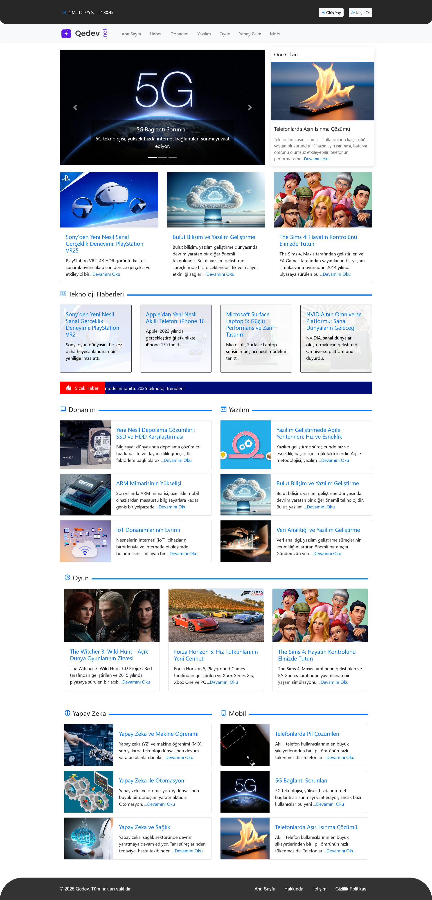

# Qedev Technology Blog Site
# Project Description
Qedev is a modern and comprehensive blog platform for technology enthusiasts. Developed using HTML, CSS, and JavaScript, it offers content across various technology categories.

# Features
- Responsive and modern design
- User interface developed with Bootstrap 4
- Enhanced with Boxicons
- Multiple content categories (News, Hardware, Software, Gaming, Artificial Intelligence, Mobile)
- Carousel slider for featured content
- Latest technology news and articles

# Technologies Used
- HTML5
- CSS3
- JavaScript
- Bootstrap 4
- Boxicons
